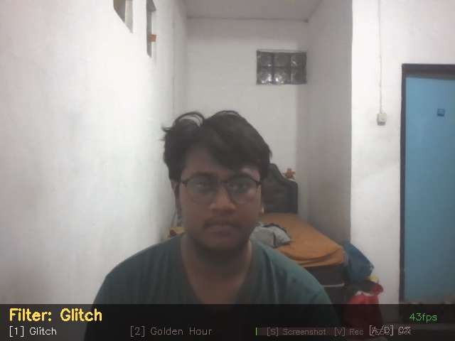

# Instagram & TikTok Style Filters in Python

A collection of creative camera effects and image processing filters implemented in Python using **OpenCV** and **NumPy**. This repository demonstrates real-time visual effects including Glitch distortion and warm Golden Hour color grading.

---

## Demo: Glitch & Golden Hour Effects

<p align="center">
  
  
  
</p>

---

## Project Demonstration

The algorithmic breakdown and live demonstration of the glitch and golden hour filter effects can be watched on YouTube:

[](https://youtu.be/shQbRugoAUo?si=aI6wXbDWFeG_BvUL)

> **Watch the full explanation here:** [Analisis dan Penerapan Glitch serta Golden Hour pada Pengolahan Citra Digital](https://youtu.be/shQbRugoAUo?si=aI6wXbDWFeG_BvUL)

---

## Requirements

To run these filters, install the necessary dependencies via pip:

```bash
pip install -r requirements.txt